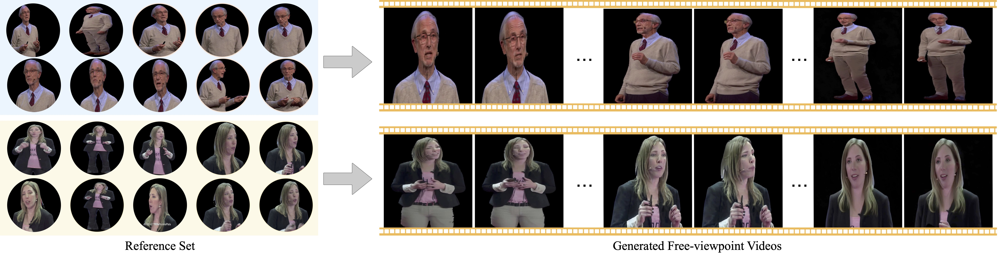
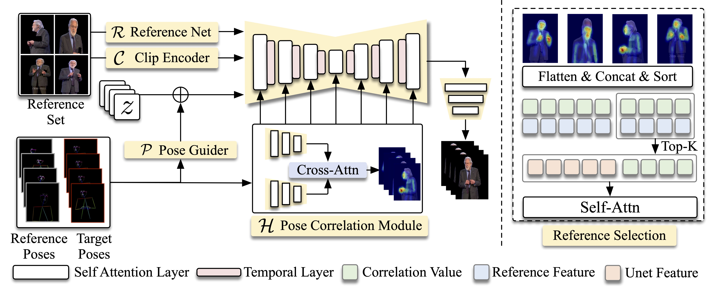

# FVHuman: Free-viewpoint Human Animation with Pose-correlated Reference Selection

<div align="center">


[](https://openaccess.thecvf.com/content/CVPR2025/papers/Hong_Free-viewpoint_Human_Animation_with_Pose-correlated_Reference_Selection_CVPR_2025_paper.pdf)
[](https://arxiv.org/pdf/2412.17290)
[](https://harlanhong.github.io/publications/fvhuman/index.html)

**[Fa-Ting Hong](https://harlanhong.github.io/)<sup>1,2</sup>, [Zhan Xu](https://research.adobe.com/person/zhan-xu/)<sup>2</sup>, [Haiyang Liu](https://research.adobe.com/person/haiyang-liu/)<sup>2</sup>, [Qinjie Lin](https://research.adobe.com/person/qinjie-lin/)<sup>3</sup>, [Luchuan Song](https://research.adobe.com/person/luchuan-song/)<sup>2</sup>, [Zhixin Shu](https://research.adobe.com/person/zhixin-shu/)<sup>2</sup>, [Yang Zhou](https://research.adobe.com/person/yang-zhou/)<sup>2</sup>, [Duygu Ceylan](https://research.adobe.com/person/duygu-ceylan/)<sup>2</sup>, [Dan Xu](https://faculty.hkust.edu.hk/profiles/danxu)<sup>1</sup>**

<sup>1</sup>HKUST, <sup>2</sup>Adobe Research, <sup>3</sup>Northwestern University

</div>

## 🎬 Demo

**FVHuman is able to generate free-viewpoint human videos from multiple images.**

<div align="center">

</div>

### Video Demo

<div align="center">
<video src="assets/comparison_video.mp4" width="80%" controls>
Your browser does not support the video tag.
</video>
</div>

For more video demonstrations and qualitative comparisons, please check out our [project page](https://harlanhong.github.io/publications/fvhuman/index.html) for additional high-quality video results and detailed experimental analysis.

## 📖 Abstract

Diffusion-based human animation aims to animate a human character based on a source human image as well as driving signals such as a sequence of poses. Leveraging the generative capacity of diffusion model, existing approaches are able to generate high-fidelity poses, but struggle with significant viewpoint changes, especially in zoom-in/zoom-out scenarios where camera-character distance varies. This limits the applications such as cinematic shot type plan or camera control. 

We propose a **pose-correlated reference selection diffusion network**, supporting substantial viewpoint variations in human animation. Our key idea is to enable the network to utilize multiple reference images as input, since significant viewpoint changes often lead to missing appearance details on the human body. To eliminate the computational cost, we first introduce a novel **pose correlation module** to compute similarities between non-aligned target and source poses, and then propose an **adaptive reference selection strategy**, utilizing the attention map to identify key regions for animation generation.

## 🌟 Key Features

- **Free-viewpoint Human Animation**: Generate human videos with substantial viewpoint changes
- **Pose-correlated Reference Selection**: Intelligent selection of relevant reference regions
- **Multi-reference Input**: Utilizes multiple reference images for comprehensive appearance modeling
- **Adaptive Selection Strategy**: Attention-based identification of key regions for animation
- **Large Viewpoint Variations**: Supports zoom-in/zoom-out scenarios and camera control

## 🔧 Installation

```bash
# Clone the repository
git clone https://github.com/harlanhong/FVHuman.git
cd FVHuman

# Create conda environment
conda create -n fvhuman python=3.8
conda activate fvhuman

# Install dependencies
pip install -r requirements.txt
```

## 🚀 Quick Start

### Inference

```bash
# Run inference with multiple reference images
python inference.py \
    --reference_images path/to/reference/images \
    --target_poses path/to/target/poses \
    --output_dir path/to/output \
    --config configs/inference.yaml
```

### Example Usage

```python
from fvhuman import FVHumanModel

# Load pre-trained model
model = FVHumanModel.from_pretrained("path/to/checkpoint")

# Prepare inputs
reference_images = ["ref1.jpg", "ref2.jpg", "ref3.jpg"]
target_poses = "path/to/pose_sequence.json"

# Generate animation
output_video = model.animate(
    reference_images=reference_images,
    target_poses=target_poses,
    viewpoint_change="large"  # Options: "small", "medium", "large"
)
```

## 📊 MSTed Dataset

We introduce the **Multi-Shot TED (MSTed) dataset**, designed to capture significant variations in viewpoints and camera distances:

- **1,084 unique identities**
- **15,260 video clips**
- **~30 hours** of total content
- **Diverse viewpoints** and camera distances
- **Professional quality** TED talk videos

### Dataset Download: [Link](https://drive.google.com/file/d/19nd47f8K3e_zC2p16xBs6V2UCi0Pl_HN/view?usp=sharing)


### Dataset Structure

```
data/
├── msted/
│   ├── videos/
│   │   ├── identity_001/
│   │   │   ├── clip_001.mp4
│   │   │   └── ...
│   │   └── ...
│   ├── poses/
│   │   ├── identity_001/
│   │   │   ├── clip_001_poses.json
│   │   │   └── ...
│   │   └── ...
│   └── metadata.json
```

## 📝 Model Architecture

<div align="center">

</div>

The illustration of our framework. Our framework feeds a reference set into reference UNet to extract the reference feature. To filter out the redundant information in reference features set, we propose a pose correlation guider to create a correlation map to indicate the informative region of the reference spatially. Moreover, we adopt a reference selection strategy to pick up the informative tokens from the reference feature set according to the correlation map and pass them to the following modules.

Our framework consists of:

1. **Reference UNet**: Extracts reference features from multiple input images
2. **Pose Correlation Module**: Computes similarities between target and source poses
3. **Adaptive Reference Selection**: Selects informative tokens based on correlation maps
4. **Animation Generation**: Synthesizes final human animation

## 🎯 Results

Our method achieves superior performance compared to SOTA methods under large viewpoint changes:

- **Qualitative Results**: High-fidelity human animation with diverse viewpoints
- **Quantitative Evaluation**: Improved metrics on viewpoint variation scenarios
- **User Studies**: Preferred by users for realistic viewpoint transitions

For detailed experimental results and visual comparisons, please refer to our [project page](https://harlanhong.github.io/publications/fvhuman/index.html) and the full paper.

## 📚 Citation

If you find this work useful for your research, please cite:

```bibtex
@article{hong2024fvhuman,
  author    = {Hong, Fa-Ting and Xu, Zhan and Liu, Haiyang and Lin, Qinjie and Song, Luchuan and Shu, Zhixin and Zhou, Yang and Ceylan, Duygu and Xu, Dan},
  title     = {Free-viewpoint Human Animation with Pose-correlated Reference Selection},
  journal   = {CVPR},
  year      = {2025},
}
```

## 🔗 Related Links

- **Project Page**: [https://harlanhong.github.io/publications/fvhuman/index.html](https://harlanhong.github.io/publications/fvhuman/index.html)
- **Paper**: [arXiv](https://arxiv.org/pdf/2412.17290)
- **CVPR 2025**: [Conference Page](https://cvpr.thecvf.com/)

## 📜 License

This project is licensed under the [Creative Commons Attribution-ShareAlike 4.0 International License](https://creativecommons.org/licenses/by-sa/4.0/).

## 🙏 Acknowledgments

We thank the creators of TED talks for providing diverse and high-quality video content that made the MSTed dataset possible. We also acknowledge the support from HKUST and Adobe Research.

## 📧 Contact

For questions and collaborations, please contact:
- Fa-Ting Hong: [fhongac@connect.ust.hk](mailto:fhongac@connect.ust.hk)

---

<div align="center">
⭐ If you find this project helpful, please consider giving it a star! ⭐
</div> 